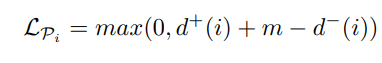

Source code address https://github.com/hyBlue/FSRE-Depth

In this code, we delete the redundant code and retrain semantic-guide-triplet-loss for study in the future.
For simplicity, we modify the some code.

## Schematic diagram
   

## Formula for calculating positive and negative sample distances
   

## Formula for triplet loss
   

## Formula for sum loss(only for boundary pixel)
   